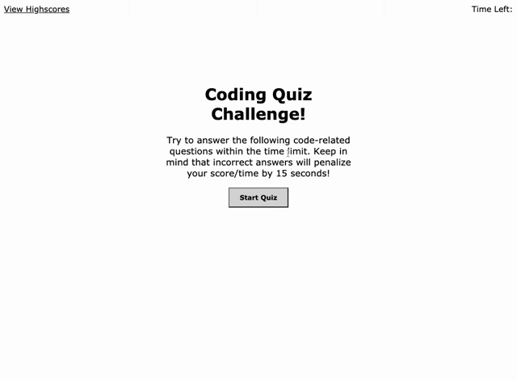

  

  # code-quiz

  This is a project to test our HTML/CSS/JS/WebAPI abilities. The goal is to build a website that tests the users knowledge of web development principles. It is a timed quiz that records the users highest scores based on how many they got right and how fast they completed the quiz. 
  
  ## Table of Contents
  
  - [Installation](#installation)
  - [Usage](#usage)
  - [GIF](#gif)
  - [Support](#support)
  - [Contributing](#contributing)
  - [License](#license)
  - [Questions](#questions)
  
  ## Installation

    You can fork it and run it locally just opening it on your local browser 

    View my project at: https://mschall217.github.io/code-quiz/
  
  ## Usage
  
  The game works when the user clicks start they are prompted with 5 random questions about coding! This is timed to see how well you can do, every wrong answer subtracts 10 from your time. The highest score wins! The highest scores are recorded on a high score page in which you can clear when you're tired of seeing someone else win. 

  ## Gif 

  
  
  ## Support
  
  Please [open an issue](https://github.com/mschall217/code-quiz/issues) for support.
  
  ## Contributing
  
  My tutors/TAs/Classmates! Thanks as always!
  
  ## License

  MIT License

    Copyright (c) 2021 Morgan Schall
    
    Permission is hereby granted, free of charge, to any person obtaining a copy
    of this software and associated documentation files (the "Software"), to deal
    in the Software without restriction, including without limitation the rights
    to use, copy, modify, merge, publish, distribute, sublicense, and/or sell
    copies of the Software, and to permit persons to whom the Software is
    furnished to do so, subject to the following conditions:
    
    The above copyright notice and this permission notice shall be included in all
    copies or substantial portions of the Software.
    
    THE SOFTWARE IS PROVIDED "AS IS", WITHOUT WARRANTY OF ANY KIND, EXPRESS OR
    IMPLIED, INCLUDING BUT NOT LIMITED TO THE WARRANTIES OF MERCHANTABILITY,
    FITNESS FOR A PARTICULAR PURPOSE AND NONINFRINGEMENT. IN NO EVENT SHALL THE
    AUTHORS OR COPYRIGHT HOLDERS BE LIABLE FOR ANY CLAIM, DAMAGES OR OTHER
    LIABILITY, WHETHER IN AN ACTION OF CONTRACT, TORT OR OTHERWISE, ARISING FROM,
    OUT OF OR IN CONNECTION WITH THE SOFTWARE OR THE USE OR OTHER DEALINGS IN THE
    SOFTWARE.
  
  ## Questions 
  If you have any questions or concerns please reach out to Morgan Schall on GitHub at mschall217 or email at morgan.allison.schall@gmail.com 
  
  